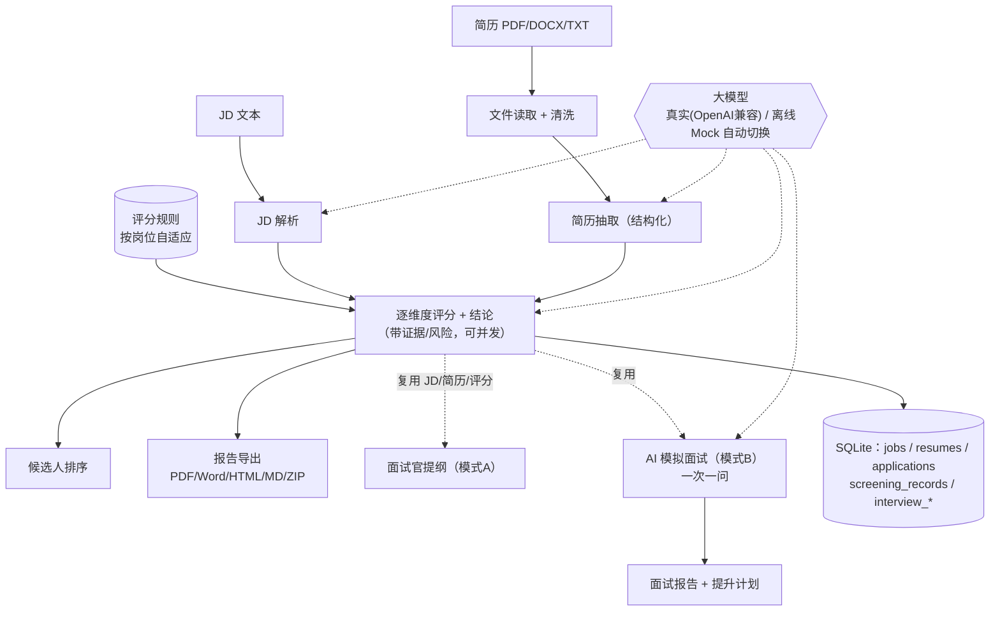

# HR 提效智能体（HR AI Agent）

[](https://github.com/Landjun/hr-ai-agent/actions/workflows/ci.yml)


📖 English version: [README.en.md](README.en.md)

> 面向 **HR / 招聘负责人 / 面试官** 的 AI 提效系统。
> 自动读 JD、读简历、抽取结构化信息、按规则**带证据地**评分、生成筛选结论与面试提纲，
> 还能作为 **AI 面试官** 对你进行模拟面试并生成提升报告。
>
> 核心理念：**AI 只做辅助判断，不做最终录用决定；每个判断都要有证据、可追溯。**

## ✨ 特性亮点

- **零配置可跑**：不填 API Key 自动进入离线 Mock（关键词启发式），整条流水线照常演示。
- **带证据评分**：7 维结构化打分，每个维度输出 `得分 / 证据 / 风险 / 理由`，可解释可追溯。
- **岗位自适应规则**：按岗位类别模糊匹配评分规则（任意「…产品经理」JD 自动用 PM 维度），新增岗位只需丢一个 JSON。
- **稳健不崩**：真实大模型报错（余额不足 / 鉴权 / 超时）自动降级离线，并触发熔断，不让页面崩、不白等。
- **并发提速**：批量简历并行评分，10 份从 ~4 分钟降到 ~30 秒。
- **双智能体**：简历筛选 + AI 面试（协助面试官提纲 / 一次一问的模拟面试）。
- **架构预留**：飞书多维表格 / Coze / 企业微信集成接口已留好。

## 📂 效果示例（无需运行，直接在 GitHub 上看）

- [候选人排序表](docs/examples/ranking_sample.md)
- [单人初筛报告（分维度+证据+风险+建议面试题）](docs/examples/screening_report_sample.md)
- [AI 模拟面试报告（分维度+每题复盘+7天提升计划）](docs/examples/interview_report_sample.md)

## 🖼️ 界面预览

> 截图占位：本地运行后把截图保存到 [`docs/screenshots/`](docs/screenshots/)（命名见该目录说明），
> 再取消下面注释即可在此展示。推荐 3 张：首页 Dashboard、③ 简历筛选排序表、⑤ AI 模拟面试。

<!--  -->
<!--  -->
<!--  -->

## 🏗️ 架构总览



---

## 1. 这是什么 / 解决什么问题

招聘初筛痛点：简历格式杂、人工录入慢、打分凭感觉、标准不统一、淘汰说不清理由、
面试提纲临时拍脑袋、候选人数据散落无法沉淀。

本项目把这些环节自动化：

- **第一版 · 简历筛选智能体**：JD 解析 → 简历抽取 → 7 维结构化评分（每维有证据/风险）
  → 筛选结论 → 候选人排序 → 一键导出 Excel/Markdown/JSON 报告。
- **第二版 · 协助面试官智能体**
  - 模式 A：为面试官生成结构化面试提纲（含追问与评分指引）。
  - 模式 B：输入 JD，AI **一次只问一个问题**地面试你，最后生成「面试报告 + 7 天提升计划」。

> ✨ **零配置即可运行**：不填任何 API Key 时，系统自动进入「离线 Mock 模式」，
> 用内置规则模拟大模型，整条流水线照常跑通、可演示。填了 Key 就自动切换真实大模型。

---

## 2. 技术栈

Python 3.10+ · FastAPI · Streamlit · SQLite · SQLModel · Pydantic ·
python-docx / pdfplumber / pypdf · pandas / openpyxl · OpenAI 兼容 SDK（DeepSeek/通义/OpenAI）· pytest

---

## 3. 安装

```bash
pip install -r requirements.txt
```

## 4. 配置 API Key（可选）

```bash
# Windows PowerShell:  Copy-Item .env.example .env
cp .env.example .env
```

编辑 `.env`：
- **想零配置演示** → 什么都不用填，保持 `LLM_API_KEY=` 为空即可（离线 Mock）。
- **想用真实大模型** → 填入 `LLM_API_KEY`，并按提供方设置 `LLM_BASE_URL` / `LLM_MODEL`：

| 提供方 | LLM_BASE_URL | LLM_MODEL |
| --- | --- | --- |
| DeepSeek | https://api.deepseek.com/v1 | deepseek-chat |
| OpenAI | https://api.openai.com/v1 | gpt-4o-mini |
| 通义千问 | https://dashscope.aliyuncs.com/compatible-mode/v1 | qwen-plus |

> 🔒 API Key 只放 `.env`，绝不写死在代码里，`.env` 已在 `.gitignore` 中。

## 5. 运行

**方式一（推荐演示）：只跑前端，直接调用服务层，无需启动后端**

```bash
streamlit run web/streamlit_app.py
```

**方式二：跑后端 API（提供 REST 接口 / Swagger 文档）**

```bash
python run.py
# 打开 http://127.0.0.1:8000/docs 查看交互式 API 文档
```

两者可同时运行。数据库与默认评分规则会在首次启动时自动创建。

---

## 6. 怎么用

### 第一版 · 简历筛选
1. 「② JD 管理」粘贴 JD → 解析（已预填样例 JD）。
2. 「③ 简历筛选」选 JD → 上传/粘贴简历（PDF/DOCX/TXT/MD）→ 解析并评分。
3. 看候选人排序表 → 生成单人初筛报告 → 导出 Excel/Markdown/JSON。

### 第二版 · 面试
4. 「④ 面试官助手」选 JD + 候选人 + 轮次/时长 → 生成面试提纲。
5. 「⑤ AI 模拟面试」输入 JD（可选简历）→ 开始 → AI 一次问一题 → 结束生成报告。

### 导出报告
- 排序表：`③ 简历筛选` 页导出按钮，或 API `GET /reports/ranking/{job_id}?fmt=excel`（excel/markdown/json）。
- 初筛报告：页面一键下载 **PDF / Word / HTML / Markdown**，或 API `GET /reports/screening/{application_id}?fmt=pdf`（markdown/html/pdf/docx）。
- 面试报告：模拟面试结束后下载 **PDF / Word / HTML / Markdown**，或 API `GET /reports/interview/{session_id}?fmt=docx`。
- **一键打包**：`③` 页一个按钮把「排序表 + 全部候选人报告」打成 ZIP（PDF/Word/HTML/Markdown 可选），或 API `GET /reports/package/{job_id}?fmt=docx`。
- **数据管理**：首页 Dashboard 的「🗑️ 数据管理」可删除单个岗位数据或清空全部（保留评分规则）。
- PDF 用 reportlab 内置 CJK 字体渲染，中文正常、跨平台、无需安装额外字体；HTML 可在浏览器 Ctrl+P 另存为 PDF。
- 文件默认输出到 `outputs/`。

### 按岗位定制评分规则（已内置：医疗AI产品经理）

系统按 JD 的岗位名 `job_title` **自动选用**对应评分规则（找不到回退「通用」7 维）。
新增一个岗位规则**无需改代码**——在 `data/` 放一个 `scoring_rules_<岗位>.json` 即可，
启动时自动入库。已内置示例：

**已内置 15 套规则**（覆盖安全 / AI / 数据 / 研发，按岗位名自动路由，大小写无关）：

| 方向 | 岗位规则 |
| --- | --- |
| 安全 | 网络安全渗透测试工程师 · AI安全工程师 · 安全运营工程师 · 安全研究员 |
| AI / 算法 | 大模型应用开发工程师 · 算法工程师 · NLP工程师 · 计算机视觉工程师 · MLOps工程师 |
| 数据 | 数据科学家 · 数据分析师 |
| 产品 | AI产品经理 · 医疗AI产品经理 |
| 通用 | 后端开发工程师 · 通用（兜底） |

例如「网络安全渗透测试工程师」7 维：安全攻防实战 25 / 漏洞挖掘与利用 20 /
安全工具与编程 15 / 实战项目与成果 20 / 安全合规与体系 5 / 教育背景 5 / 加分项 10。
路由示例：`资深渗透测试工程师` → 渗透规则；`大模型AI安全专家` → AI安全规则；
`Java后端工程师` → 后端规则；不匹配则回退「通用」。

体验：把 `data/sample_jd_medical_pm.md` 粘到「② JD 管理」解析（岗位名会识别为
「医疗AI产品经理」），再到「③ 简历筛选」上传 `data/sample_resume_medical_pm_*.md`
即可看到按 PM 维度打分的排序与带证据的报告。

---

## 7. 项目结构

```
hr-ai-agent/
├── README.md / requirements.txt / .env.example / run.py
├── app/
│   ├── config.py          # 配置（含离线 Mock 判定）
│   ├── database.py        # 建表 + 默认评分规则
│   ├── models.py          # 7 张 SQLModel 表
│   ├── schemas.py         # Pydantic 结构化契约
│   ├── llm_client.py      # OpenAI 兼容客户端（含离线路由）
│   ├── mock_llm.py        # 离线 Mock 启发式引擎
│   ├── services/          # JD/简历/评分/筛选/面试/报告 服务
│   ├── prompts/           # 7 个 prompt（.md）
│   ├── routers/           # FastAPI 路由
│   └── utils/             # 文件读取/清洗/JSON/评分换算
├── web/streamlit_app.py   # 6 页演示前端
├── data/                  # 样例 JD/简历 + scoring_rules.json
├── docs/                  # 案例/工作流/表/Prompt/演示 文档
├── outputs/               # 报告产出
└── tests/                 # pytest（离线可跑）
```

## 8. 测试

```bash
pytest -q
```

全部用例离线可跑（强制 Mock 模式 + 临时数据库），覆盖：简历抽取、JD 解析、
分维度评分、强弱候选人排序、面试一次一问、空答低分、完整模拟面试生成报告。

---

## 9. 智能体安全与边界

- AI 不做最终录用决定，只做辅助判断；结论标注「仅供 HR 辅助参考，最终由人工确认」。
- 必须输出证据，不允许只给结论；简历中无证据的能力不默认具备。
- 不依据性别、婚育、民族、宗教、健康等非岗位相关因素做负面判断。
- 年龄/学历/年限仅在 JD 明确要求时作为岗位匹配信息。
- 低置信度判断标记「需人工复核」；所有评分可解释、可追溯。

## 10. 后续接入飞书多维表格 / Coze / 企业微信

`.env` 与 `app/config.py` 已预留 `FEISHU_*` / `COZE_*` / `WECHAT_WORK_*`。
服务层统一通过 `llm.run(task, ...)` 与数据表交互，接入外部系统时只需新增
「sink/source 适配器」（如把 `applications` 评分写回飞书多维表格），核心流程不变。
设计思想详见 [docs/workflow_design.md](docs/workflow_design.md)。

## 11. 二次开发建议

- 按岗位复制 `data/scoring_rules.json` 并调权重；扩充 `app/mock_llm.py` 的技能/院校词库。
- 增加 JD-简历语义向量匹配，减少关键词漏判。
- 接入真实大模型后做 A/B 评测，校准与 Mock 的一致性。
- 把 Streamlit 演示前端替换为飞书小程序 / 企业微信侧边栏。

## 12. 写进作品集 / 简历 / 面试

**一句话定位**：从 0 到 1 设计并实现的「HR 简历筛选 + AI 面试」提效智能体，
覆盖产品设计、Agent 工作流编排、Python 全栈与工程落地。

**简历可量化写法**：
- 设计 7 维结构化评分模型（加权指标匹配），把「凭感觉初筛」变为带证据、可追溯的评估，
  单份初筛从 5-10 分钟降到 1-2 分钟。
- 用「任务拆分 + JSON 三重兜底」保证大模型输出稳健，离线/真实模型双模式可切换。
- 实现一次一问的 AI 模拟面试智能体，含逐轮打分与提升报告。

**面试可讲的亮点**：任务拆分为何提速提质、评分如何可解释、如何防止 AI 越权做录用决定、
如何为接入飞书/Coze 预留架构。

📣 **完整讲解稿**（电梯演讲 / 3 分钟结构 / 高频问题参考答案 / 简历写法）：
[docs/interview_pitch.md](docs/interview_pitch.md)；设计细节见 [docs/case_study.md](docs/case_study.md)。
